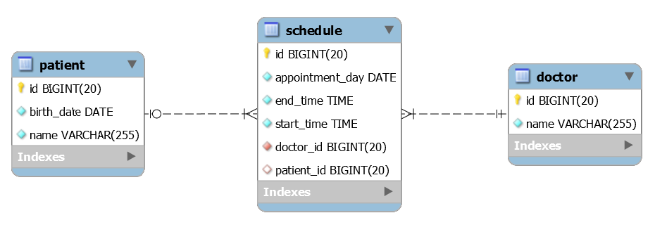

:seminar-link: http://www.ksug.org/seminar/20151024
:seminar-slide-link: http://slides.com/gmind7/spirngrestdocs
:lombok-link: https://projectlombok.org

= Modern Java web application with Spring

== Overview

{seminar-link}[Modern Java web application with Spring] 세미나를 통해 공유한

Making your API easy to document with Spring REST Docs 섹션 샘플링 프로젝트 입니다.

=== Example RESTful API Documents

image::restfulapi-documents.png[]

=== Example RESTful API Data Schema

== Learning more

{seminar-slide-link}[Slides] 자료

== Building from source

requires Java8

* gradle spring boot WAS Start

[source,groovy,indent=0]
----
gradlew copyAsciidocResources bootRun
----

API : http://127.0.0.1:8080

Doc : http://127.0.0.1:8080/docs

* IDEA, STS, Eclipse WAS Start

requires {lombok-link}[Lombok]

gradlew copyAsciidocResources task 실행하면 *.adoc -> *.html 만들어 진 후 src/main/resource/static/docs 폴더 밑에 copy 되어 집니다.

[source,groovy,indent=0]
----
gradlew copyAsciidocResources
----

src/main/resource/static/docs/*.html 만들어 졌으면 MainClass로 서버를 시작 합니다.

MainClass : io.example.SampleBootRunner.class
